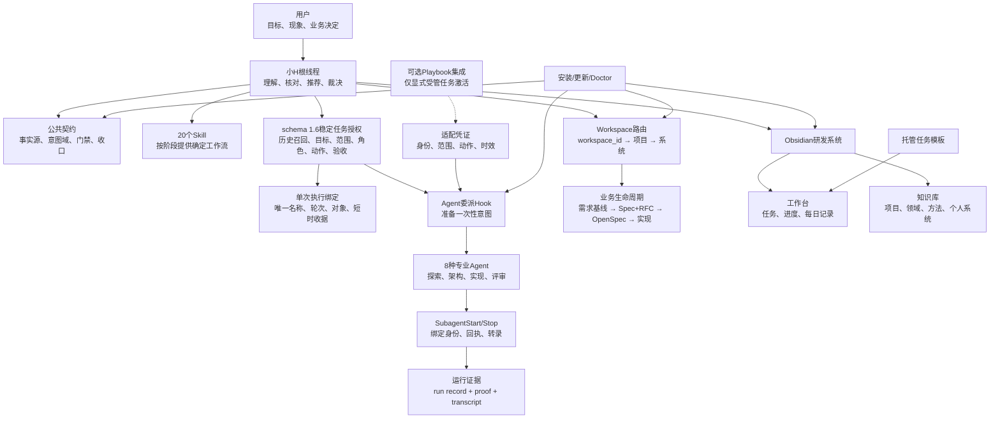
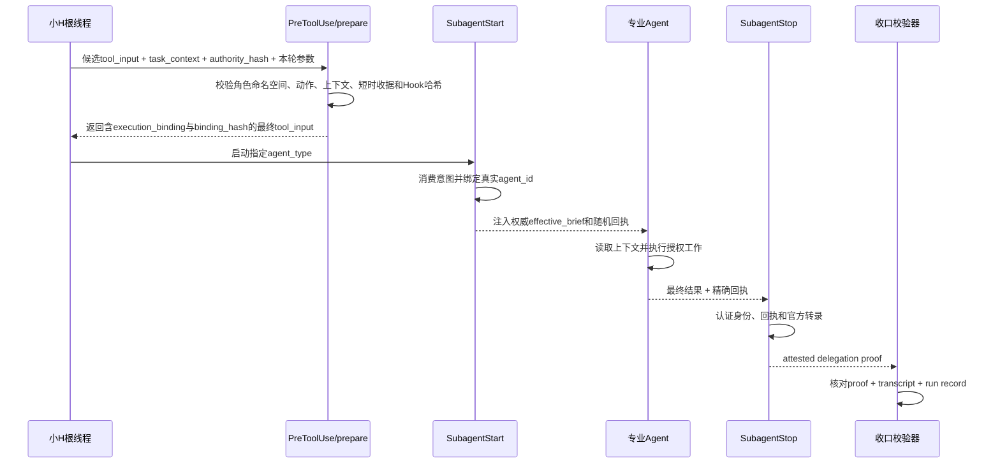
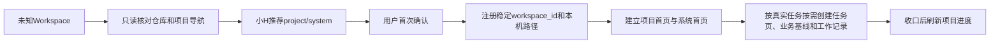

# 小H实现设计

> 适用版本：2.17.0
>
> 本文面向维护者，说明小H的组件、事实源、运行门禁和任务生命周期。
>
> 不包含：任何客户、项目、仓库、任务、账号、凭据或本机绝对路径。

第一次使用小H，请先读[认识小H](xiaoh-guide.md)。只想了解Playbook分工，请读[小H与Playbook的关系](xiaoh-playbook-relationship.md)。本文保留实现细节，适合开发、排障和发布检查。

## 1. 小H是什么

小H是运行在Codex根对话中的研发协调系统，不是一个同名子Agent，也不是只靠一段长Prompt工作的聊天角色。

它由以下部分共同实现：

1. Codex插件：发布20个Skill和插件元数据。
2. 根线程协调规则：理解用户目标、核对证据、形成推荐方案并持续推进。
3. 公共执行契约：为根线程和所有专业Agent规定事实源、权限、门禁、证据和收口要求。
4. 专业Agent目录：提供8种跨项目复用的探索、设计、实现和评审角色。
5. 运行时Hook：约束Agent委派和Obsidian写入路径。
6. 任务治理资产：使用schema 1.6稳定任务授权、一次性执行绑定、项目历史召回清单、运行记录、路由案例和校验器形成可检查证据。
7. 本地运行时管理：负责安装、更新、诊断、Workspace注册和托管任务绑定。
8. Obsidian研发系统：将当前工作、项目进度和长期知识分开管理。

小H负责解决这些问题：

- 用户只描述目标，不负责替AI拆流程。
- 小H先核对事实，再给出推荐和需要用户决定的业务结果。
- 用户确认后，小H自动推进已授权范围内的后续动作。
- 专业Agent在明确任务上下文和权限范围内工作。
- 高风险实现和判断使用独立角色评审。
- 任务完成立即形成可追溯记录，稳定知识经过候选、评审和晋升后长期保存。

## 2. 设计目标与非目标

### 2.1 设计目标

- 主动协调：小H负责分析、拆解、路由、验收和收口。
- 证据优先：用户的疑问或假设不会自动覆盖代码、配置、数据和运行事实。
- 建设性异议：发现事实冲突时说明证据、影响和推荐结论，不盲目附和。
- 最少必要确认：只询问真正改变业务结果、权限、安全边界或交付范围的问题。
- 持续执行：确认推荐基线后，不要求用户反复发送“继续”。
- 受控委派：专业Agent只能消费经过校验的任务上下文和角色授权。
- 跨项目复用：Agent、Skill和公共契约不固化具体项目事实。
- 知识可追溯：项目事实、需求基线、工作证据和正式知识各有唯一职责。
- 跨平台：macOS和Windows使用同一插件内容，通过平台脚本部署。

### 2.2 非目标

- 不替用户决定业务目标和最终取舍。
- 不允许Obsidian替代代码、Spec、OpenSpec、Playbook或运行证据。
- 不让专业Agent维护独立的长期项目记忆。
- 不自动把一次成功经验提升为跨项目规则。
- 不自动执行生产操作、审批、发布、合并或不可逆外部动作。
- 不声称抵抗拥有同等操作系统写权限的操作者整体替换治理文件。

## 3. 总体架构



## 4. 仓库组件与事实源

| 组件 | 路径 | 职责 |
| --- | --- | --- |
| 插件清单 | `plugins/xiaoh/.codex-plugin/plugin.json` | 插件名称、版本、Skill入口和界面信息 |
| 根协调Skill | `plugins/xiaoh/skills/xiaoh-core/SKILL.md` | 小H交互、协调、结束条件与知识写回逻辑 |
| 其他Skill | `plugins/xiaoh/skills/*/SKILL.md` | Workspace、需求、评审、收口、诊断等阶段工作流 |
| 公共契约 | `plugins/xiaoh/runtime/codex/AGENTS.md` | 所有Agent必须遵守的通用规则 |
| 专业Agent | `plugins/xiaoh/runtime/codex/agents/*.toml` | 角色职责、推理强度和Sandbox权限 |
| Hook配置 | `plugins/xiaoh/runtime/codex/root-agent-hook.toml` | 四类运行时Hook的注册模板 |
| Hook实现 | `plugins/xiaoh/runtime/codex/hooks/` | Agent委派、Vault路径和运行时信任校验 |
| 治理校验器 | `plugins/xiaoh/runtime/codex/agent-system/validate.py` | 上下文、运行记录、路由和收口门禁校验 |
| 可选Playbook适配器 | `plugins/xiaoh/runtime/codex/agent-system/playbook_adapter.py` | 按`auto/enabled/disabled`配置激活；仅为明确受管任务探测只读接口、生成短时绑定并重验状态 |
| 上下文模板 | `plugins/xiaoh/runtime/codex/agent-system/task-context.template.json` | schema 1.6稳定任务授权结构 |
| 运行记录模板 | `plugins/xiaoh/runtime/codex/agent-system/run-record.template.json` | 门禁、验证、指标和结果采纳证据 |
| 路由案例 | `plugins/xiaoh/runtime/codex/agent-system/routing-cases.json` | 代表性任务的最小角色集合回归基线 |
| 运行时管理器 | `plugins/xiaoh/scripts/xiaoh.py` | 安装、更新、Doctor、Workspace和自动化绑定 |
| 配套能力清单 | `plugins/xiaoh/dependencies.json` | 捆绑Skill、推荐插件和可选外部能力 |
| 托管任务清单 | `plugins/xiaoh/managed-automations.json` | 每日成果推送和每周知识评审模板 |
| Vault模板 | `plugins/xiaoh/runtime/obsidian/development-vault/` | 工作台、项目、知识和记录模板 |
| Vault受管清单 | `plugins/xiaoh/runtime/obsidian/managed-vault-files.json` | 更新时可以安全同步的模板及历史哈希 |

事实源按维度分工：

| 要回答的问题 | 权威事实源 |
| --- | --- |
| 用户最终想要什么 | 当前用户指令、已确认需求和已验收Spec |
| Agent是否有权执行 | 会话指令、Agent TOML、适用`AGENTS.md`、Playbook状态 |
| 系统现在实际怎么运行 | 代码、配置、测试结果和运行证据 |
| Workspace属于哪个项目和系统 | `~/.xiaoh/config.json`中的`workspaces`注册表 |
| 长期稳定知识是什么 | 配置Vault中的正式知识页、ADR、术语和项目导航 |

不同维度发生冲突时不会互相覆盖。例如，代码可以证明当前行为，但不能替用户决定目标行为；Obsidian可以帮助召回稳定结论，但不能绕过代码仓库或任务权限。

### 4.1 项目历史召回

业务任务先通过Workspace注册表确定项目和系统，再由`xiaoh-project-recall`按当前主题定向读取项目进度、相关任务收口、规范需求基线和已晋升知识。每日摘要只用于定位，不作为唯一权威来源。随后读取当前代码、配置、Spec+RFC、OpenSpec或任务状态，显式记录历史与现状的冲突。

原始证据使用`xiaoh-project-recall/v1` JSON清单保存在任务证据目录；没有受管任务目录时放入小H配置目录的`evidence/recall`。清单绑定任务ID、Workspace、当前操作系统平台、任务关系和具体查询；每个历史来源、已检查索引和当前事实文件都记录内容SHA-256，schema 1.6任务上下文再保存清单绝对路径、SHA-256和完成时间。

Validator会拒绝跨任务复用、过期或内容漂移、越出配置Vault、当前平台未绑定、空查询、空历史缺少索引检查证据、同一文件通过路径大小写/硬链接/Unicode别名伪装成多类来源、需求基线权威来源缺少稳定确认点ID，以及缺少独立非摘要权威来源的清单。文件身份使用设备号与inode判等，文件哈希采用流式读取，避免路径字符串绕过和大文件校验放大内存占用。这样Obsidian中的推送内容成为后续分析的可验证输入，同时不会被误当成当前实现或执行权限。

## 5. 根线程交互逻辑

### 5.1 用户输入分类

小H先把重要用户表达分类为：

| 类型 | 含义 | 是否改变基线 |
| --- | --- | --- |
| `question` | 提问、反问、质疑 | 否 |
| `hypothesis` | 假设或推测 | 否 |
| `fact_correction` | 对现有事实的纠正 | 证据支持后才改变事实记录 |
| `business_decision` | 用户明确选择业务结果 | 是 |
| `execution_instruction` | 用户授权执行明确动作 | 只改变执行状态，不自动改变业务语义 |

这解决了“用户问了一句为什么，Agent就把问题当成取消需求”的问题。疑问不会自动缩减范围，事实纠正需要证据，业务决定则保留影响说明后进入基线。

### 5.2 推荐优先

信息不足时，小H不会把整理责任退回给用户，而是：

1. 读取任务范围内的代码、配置、文档和历史事实。
2. 整理目标、约束、风险、未知项和验收结果。
3. 给出推荐方案、理由、影响和边界。
4. 只询问一个真正改变结果的问题。
5. 用户确认或调整后，自动推进剩余工作。

工程方案存在实质取舍时，小H使用`fit-for-purpose-engineering`同时比较：

- 最小改动方案：复用现有结构、短期成本较低，但说明覆盖上限和技术债。
- 最合适改动方案：按正确领域职责和生命周期设计，说明迁移成本和长期收益。

如果两种方案实质一致，文档必须说明“两个方案收敛”，而不是机械制造选项。

### 5.3 回合结束判定

小H准备结束一个回合前，必须把下一动作归为：

- `completed`：目标已完成并验证。
- `user_decision_required`：剩余问题会改变业务结果。
- `external_blocked`：等待外部系统、人工审批或权限。
- `agent_owned`：仍有小H可以继续执行的已授权动作。

只要存在`agent_owned`动作，小H就不应结束并要求用户发送“继续”。

## 6. 三类意图域

所有副作用前必须选择且只能选择一个意图域：

| 意图域 | 典型对象 | 允许范围 |
| --- | --- | --- |
| `global_agent_capability` | 小H、Agent、Skill、Hook、全局上下文 | 全局能力和本地运行时 |
| `playbook_platform` | Playbook产品本身 | Playbook平台仓库和平台规则 |
| `business_project` | 客户项目、业务系统、业务仓库 | 具体项目的需求和交付生命周期 |

意图域防止“检查小H能力时顺手修改业务代码”或“修Playbook时把下游业务任务当平台实现”。跨域必须说明变化和影响，并取得明确授权。

## 7. Workspace项目归属

### 7.1 为什么需要Workspace路由

同一个项目可以包含多个Workspace，一个Workspace也可能在另一台电脑拥有不同绝对路径。仅靠目录名或当前打开的Obsidian页面无法可靠判断项目。

小H使用稳定`workspace_id`保存：

```json
{
  "workspaces": {
    "example-workspace": {
      "project": "示例项目",
      "system": "示例系统",
      "bindings": [
        {
          "platform": "darwin",
          "root": "<workspace-path-on-macos>"
        },
        {
          "platform": "windows",
          "root": "<workspace-path-on-windows>"
        }
      ]
    }
  }
}
```

### 7.2 解析状态

- `known`：直接复用登记的项目和系统，不再次询问。
- `unknown`：先只读核对仓库和项目导航，由小H给出推荐，只询问一次。
- `conflict`：一个路径匹配多个归属或用途变化，停止业务写入。

机器可读事实源始终是`~/.xiaoh/config.json`；Obsidian只做可读导航。

## 8. 需求与实现生命周期

### 8.1 需求工件路由

业务需求完成只读事实探索后，由`xiaoh-requirement-routing`选择唯一工件路线：

| 路线 | 使用条件 |
| --- | --- |
| `openspec_only` | 单仓局部、目标和验收清晰、无高风险语义变化 |
| `spec_rfc_then_openspec` | 跨仓、迁移、兼容、事务、安全、PKI、架构或多方案取舍 |
| `class_skill` | 已有A/B/C类正式文档Skill负责该类工件 |

### 8.2 标准复杂需求流程

```mermaid
flowchart LR
    A["用户目标"] --> B["只读事实探索"]
    B --> C["需求工件路由"]
    C --> D["形成Spec+RFC"]
    D --> E["源工件准入评审"]
    E -->|未通过| D
    E -->|OPENSPEC_READY| F["用户确认Spec+RFC"]
    F --> G["确认影响面和member"]
    G --> H["创建受管任务"]
    H --> I["逐仓派生OpenSpec"]
    I --> J["Spec/RFC与OpenSpec一致性评审"]
    J -->|未通过| I
    J -->|PASS| K["用户确认OpenSpec"]
    K --> L["实现与验证"]
    L --> M["多角色本地评审"]
    M -->|发现问题| L
    M --> N["绑定当前HEAD的收敛复审"]
    N --> O{"Playbook受管？"}
    O -->|否| P["独立交付"]
    O -->|是| Q["handoff、MR Ready和远程AI评审"]
    P --> R["即时收口和项目进度"]
    Q --> R
```



所有`implementation`任务都要求至少两个未参与实现的判断角色。`xiaoh-local-review`
保存连续评审轮次及每个角色的原始证据，最终清单绑定当前Git HEAD或不可变工件摘要。
独立模式以该清单作为交付门禁；Playbook受管模式只有在清单通过后才进入handoff、MR
Ready和远程AI评审。Playbook继续独占远程任务、pipeline、Approval、归档、合并和清理状态。

两道评审不可互换：

1. `spec-rfc-reviewer`判断源Spec+RFC本身是否达到`OPENSPEC_READY`。
2. `spec-rfc-openspec-consistency-review`同时读取已确认Spec+RFC和完整OpenSpec，判断是否完整承接且无语义漂移，要求最终`PASS`。

Spec+RFC修订号变化后，旧评审失效。OpenSpec必须形成：

`FR/NFR → Requirement/Scenario → tasks.md → 实现 → 验证证据`

### 8.3 业务需求与设计基线

用户确认、纠正、拒绝或取代重要业务规则后，`xiaoh-requirement-baseline`立即维护一项业务主题的一份规范页面。

每个确认点具有稳定ID和四种状态：

- `pending`
- `confirmed`
- `superseded`
- `rejected`

语义变化时保留旧确认点并通过`superseded_by`指向新确认点，不静默改写历史。页面同时记录设计依据、证据来源、适用范围、验收条件、工件追溯和剩余不确定项。

基线用于稳定召回，不替代仓库中的Spec+RFC和OpenSpec。

## 9. 专业Agent体系

小H只作为根线程协调者存在，仓库明确删除或拒绝`agents/xiaoh.toml`。

| Agent | 权限 | 主要职责 |
| --- | --- | --- |
| `java_code_explorer` | 只读 | 入口、调用链、数据流、配置、测试和影响面 |
| `java_architect` | 只读 | 模块边界、兼容、事务、失败恢复和技术方案 |
| `java_implementer` | Workspace写入 | 单仓Java实现和相称测试 |
| `frontend_implementer` | Workspace写入 | 页面、路由、状态、接口和前端验证 |
| `pki_domain_expert` | 只读 | CA、RA、证书、密钥、OCSP、CRL和生命周期语义 |
| `pki_security_reviewer` | 只读 | 密钥材料、信任边界、算法降级和安全失败路径 |
| `test_integration_verifier` | Workspace写入 | 独立验收矩阵和测试证据；不得修改tracked文件 |
| `code_quality_reviewer` | 只读 | 正确性、回归、并发、性能、错误处理和测试缺口 |

公共规则：

- 专业Agent不创建下级Agent。
- 不维护独立长期项目记忆。
- 写入Agent只能修改任务上下文明确允许的单一repo/worktree。
- 高风险实现者和独立评审者必须分离。
- 所有结果必须报告证据、冲突、不确定项、验证和推荐结论。

默认Agent并发配置由安装器写入：

```toml
[agents]
max_threads = 4
max_depth = 1
interrupt_message = true
```

`max_depth = 1`用于禁止专业Agent继续形成不可控的多层委派树。

## 10. 正式委派门禁

### 10.1 任务上下文

正式任务使用schema 1.6 JSON，至少记录：

- 唯一意图域。
- 目标、当前行为和目标行为。
- Workspace、仓库、允许路径和禁止动作。
- 必须读取的事实源。
- 业务项目的历史召回状态、清单路径、哈希、任务关系和完成时间。
- 用户表达类型、证据状态、冲突和范围缩减依据。
- 需求工件路线和各门禁状态。
- Agent选择和独立评审要求。
- 验收、验证、输出契约和停止条件。
- 新鲜度与不可变修订链。

schema 1.6任务上下文使用规范JSON的`authority_hash`绑定稳定授权；运行期事实由单次执行绑定单独哈希。

### 10.2 当前协作工具的委派时序



关键实现：

- `PreToolUse`拒绝把`xiaoh`作为委派目标。
- 根线程先通过`--prepare`生成一次性执行绑定，并原样使用返回的最终`tool_input`。
- `SubagentStart`重新校验稳定授权哈希、执行绑定、角色、唯一任务名和Hook哈希。
- 原始委派消息只是传输文本，不能扩大任务权限。
- `SubagentStart`把权威有效简报和随机回执注入专业Agent。
- `SubagentStop`要求精确回执，并绑定真实Agent转录。
- 意图和回执不可重放；目标文件使用独占创建防止证据覆盖。
- 任一环节异常时，该子Agent只能作为只读咨询，不能形成正式角色证据。

### 10.3 成功收口证据

正式高风险任务成功需要：

1. 当前任务上下文及其哈希。
2. 已认证的Hook委派证明。
3. 真实Codex Agent转录。
4. schema 1.2运行记录。
5. 所有gate和verification为`passed`。
6. `metrics.result_accepted = true`。
7. 高风险任务的`independent_review`通过。

等待Agent、阶段进展或旧修订记录都不能替代当前修订的成功证据。

## 11. Vault写入门禁

小H只允许向`~/.xiaoh/config.json`中`obsidian_vault`指定的唯一Vault写入。

写入前Hook会：

- 解析配置中的绝对路径。
- 要求目标Vault存在`.obsidian`标记。
- 拒绝显式指向其他Vault。
- 拒绝包含`..`的路径。
- 解析真实路径，拒绝通过符号链接逃逸。
- 同时检查文件工具和命令工具中的目标路径。

Hook无法安全判断时失败关闭。发现历史误写风险时只报告来源、目标和恢复条件，不自动删除或移动其他Vault中的内容。

## 12. Obsidian信息架构

小H把“现在做什么”和“以后复用什么”分成两个入口。

### 12.1 发布的空白Vault结构

插件发布的是不含业务内容的研发系统骨架：

```text
development-vault/
├── .obsidian/                         # Obsidian Vault标记和本地界面配置
├── AGENTS.md                          # Vault内操作边界
├── CONTEXT.md                         # Vault定位和共享上下文
├── 首页.md                            # 当前工作入口
├── 知识库.md                          # 长期知识入口
├── 00-工作台/
│   ├── 我的工作台.base               # 今日重点、待确认、项目、任务和成果视图
│   ├── 我的工作偏好.md               # 个人交互和工作偏好
│   └── 属性与状态说明.md             # Frontmatter和状态口径
├── 01-项目/
│   ├── 项目总览.md
│   ├── 项目模板.md
│   ├── 项目进度模板.md
│   └── 项目知识模板.md
├── 02-领域知识/
│   ├── 知识库.base
│   ├── 术语模板.md
│   ├── 领域知识模板.md
│   ├── 知识候选模板.md
│   └── 知识评审模板.md
├── 03-需求与方案/
│   ├── 方案模板.md
│   └── 业务逻辑基线模板.md
├── 03-可复用方法/
│   └── 复用卡模板.md
├── 05-开发与测试/
│   └── 验证记录模板.md
├── 06-部署与运维/
│   └── 运行手册模板.md
├── 07-工作记录/
│   └── 工作记录模板.md
└── 90-个人系统/
    ├── 个人系统说明.md
    ├── Agent协作角色.md
    └── Agent进化台账.md
```

这里的编号表达信息用途，不代表任务必须严格按编号顺序执行。`03-需求与方案`保存通用模板，`03-可复用方法`保存正式方法，两者名称完整，不依赖编号唯一性。

安装器只部署骨架和模板，不把示例客户或示例项目写入Vault。受管文件及历史模板哈希记录在`managed-vault-files.json`中。

### 12.2 业务项目实例结构

用户确认一个新Workspace的项目和系统归属后，小H在`01-项目`下维护项目实例。推荐结构为：

```text
01-项目/<project>/
├── 项目首页.md                        # 项目定位、系统、事实源和导航
├── 项目进度.md                        # 当前快照，不保存完整历史流水
├── 01-系统/
│   └── <system>/
│       └── 系统首页.md                # 系统边界、仓库和主要能力导航
├── 需求与任务/
│   └── <task-or-topic>.md             # 当前任务状态、交付和相关工件入口
├── 需求与方案/
│   └── <system>/
│       └── <business-topic>.md        # 一主题一份持续演进业务基线
├── 工作记录/
│   └── YYYY-MM-DD.md                  # 已验收任务和里程碑的时间序列
└── 项目知识/
    └── <knowledge-topic>.md            # 仅在该项目成立的正式知识
```

这是一套逻辑约定，不是安装阶段一次性创建所有目录。小H只在实际需要时创建页面，避免生成大量空文件。

一个项目可以包含多个Workspace和多个系统；一个Workspace只能归属一个项目和一个系统。Workspace映射保存在本地配置，项目页只保存可读导航。

### 12.3 页面职责与唯一事实源

| 页面或记录 | 保存内容 | 不保存什么 | 更新方式 |
| --- | --- | --- | --- |
| `项目首页.md` | 项目定位、系统、事实源、规则和导航 | 每日流水、完整任务日志 | 项目建立或元数据变化时更新 |
| `系统首页.md` | 系统边界、仓库、能力和系统级导航 | 其他系统的业务规则 | 系统识别或边界变化时更新 |
| `需求与任务/*.md` | 任务目标、状态、交付、阻塞和正式工件链接 | 独立演进的重复业务规则 | 任务状态或交付变化时更新 |
| `需求与方案/<system>/*.md` | 规范业务基线、确认点和设计依据 | 原始聊天全文、代码实现细节 | 业务语义确认后立即更新 |
| `项目进度.md` | 当前阶段、工作线、阻塞、风险和下一里程碑 | 历史时间序列 | 业务任务收口或项目状态变化后更新 |
| `工作记录/YYYY-MM-DD.md` | 当日已经验收的任务和里程碑 | 未验收推测、完整原始日志 | 任务完成时立即追加或幂等更新 |
| `知识候选/<candidate_id>.md` | 候选索引、来源、范围和下一动作 | 正式知识权威内容 | 收口生成，评审只更新评审元数据 |
| `项目知识/*.md` | 只在当前项目长期成立的正式结论 | 跨项目通用规则 | 交互式知识晋升后更新 |
| `02-领域知识/*.md` | 跨项目成立的领域语义和术语 | 单一项目特例 | 交互式知识晋升后更新 |
| `03-可复用方法/*.md` | 前提、变量、排除项和验证方法 | 无边界的经验总结 | 交互式知识晋升后更新 |
| `90-个人系统/*.md` | 小H、Agent、偏好、模板和个人治理 | 具体项目事实 | 全局能力验收或人工确认后更新 |

重要的去重规则：

- 业务规则的权威回忆页只有对应主题基线。
- 任务页、进度页、每日记录和正式知识只链接基线及确认点ID，不复制另一份可独立变化的规则。
- 项目进度是当前快照；每日记录是历史序列。
- 每日记录中的知识候选是来源事实；候选页面只是工作台投影。
- 仓库Spec、OpenSpec、代码和验证证据仍是实施事实源，Vault不接管它们。

### 12.4 写入触发时机与频率

| 事件 | 立即写入 | 定时处理 |
| --- | --- | --- |
| 首次识别项目或系统 | 项目首页、系统首页和导航 | 无 |
| 用户确认、纠正、拒绝或取代业务规则 | 对应主题业务基线 | 不等待每日任务 |
| 任务或稳定里程碑验收 | 当日工作记录、任务页；必要时知识候选 | 不等待每日任务 |
| 业务项目任务收口 | 同步刷新项目进度 | 不等待每日任务 |
| 全局能力或Playbook平台任务收口 | 写入各自的当日记录 | 不伪造业务项目进度 |
| 每日成果推送 | 不重写业务资料 | 每天读取前一日已收口结果并推送 |
| 每周知识评审 | 知识评审报告和候选评审元数据 | 默认暂停，启用后每周执行 |
| 知识晋升 | 更新唯一正式知识页和候选状态 | 必须由交互式小H核对，不自动晋升 |

因此，定时任务不是资料归档器。业务基线、任务总结和项目进度都在事件发生时更新；每日任务只负责把已经形成的成果推送给用户。

### 12.5 Frontmatter与状态模型

工作台和Bases依赖统一Frontmatter：

| 属性 | 含义 |
| --- | --- |
| `type` | 页面类型，例如`project`、`project_progress`、`requirement_baseline` |
| `project` | 项目身份；跨项目知识可以为空 |
| `system` | 业务基线或系统页面所属系统 |
| `domain` | 业务或能力领域 |
| `status` | 生命周期状态 |
| `health` | 当前健康度，不与生命周期混用 |
| `owner` | 下一动作负责人 |
| `needs_user_decision` | 是否存在真正需要用户决定的结果 |
| `focus` | 是否进入今日重点 |
| `next_action` | 当前最明确的下一动作 |
| `updated` | 页面事实最近更新时间 |
| `evidence_cutoff` | 项目进度使用的证据截止时间 |
| `knowledge_scope` | 正式知识所属范围 |
| `knowledge_state` | 候选、正式或已晋升等知识状态 |

标准生命周期：

`captured → clarifying → ready → in_progress → accepted → archived`

异常和候选状态：

- `blocked`：存在真实阻塞。
- `candidate`：等待知识评审。

健康状态独立使用`normal`、`at_risk`和`blocked`。历史非标准状态保存在`legacy_status`，归一化属性时不改写业务结论。

### 12.6 幂等与历史保留

为避免重复记录和静默覆盖，小H使用不同稳定键：

| 对象 | 稳定身份 |
| --- | --- |
| Workspace | `workspace_id` |
| 业务确认点 | 主题内稳定确认点ID |
| 业务基线修订 | `baseline_revision`及取代关系 |
| 任务或里程碑收口 | `closeout_key` |
| 知识候选 | `candidate_id` |
| 每周知识评审 | `xiaoh-weekly:<ISO-week>` |

相同身份的重跑执行更新而不是追加副本。语义变化时创建新修订或新确认点并保留旧记录；状态由`confirmed`变更时必须使用取代关系，不能直接删除历史。

### 12.7 新项目的落库过程



换电脑时复用`workspace_id`和项目/系统身份，只重新绑定新电脑的本地路径，不复制旧电脑绝对路径作为有效状态。

### 12.8 工作台

工作台保存执行状态：

- 今日重点。
- 待用户确认。
- 当前项目。
- 进行中的任务。
- 最近成果。
- 项目当前进度。
- 每日工作记录。
- 知识候选投影。

项目进度是当前快照，每日工作记录是时间序列，两者不能互相替代。

### 12.9 知识库

知识库只保存长期成立的结论：

- 项目知识：仅在一个项目内成立。
- 领域知识：跨项目成立的业务或技术语义。
- 可复用方法：带前提、变量、排除项和验证方法的工程做法。
- 个人系统：小H、Agent协作、偏好、模板和知识管理规则。

知识生命周期：

`工作证据 → 知识候选 → 证据评审 → 正式知识 → 修订或废止`

业务规则不复制到多个页面。正式知识只引用规范需求基线和稳定确认点ID，避免出现相互竞争的事实源。

## 13. 任务收口、项目进度与定时任务

### 13.1 即时收口

任务或稳定里程碑通过验证后，`xiaoh-task-closeout`在根线程结束前立即执行：

- 记录完成结果和决策原因。
- 记录实际变更和验证。
- 保留风险、未决项和下一动作。
- 生成稳定的`closeout_key`。
- 提取知识候选，但不自动晋升。
- 业务项目继续刷新`项目进度.md`。

记录按意图域写入：

| 意图域 | 记录位置 |
| --- | --- |
| 业务项目 | 对应项目的`工作记录/YYYY-MM-DD.md` |
| 小H全局能力 | `07-工作记录/全局能力/YYYY-MM-DD.md` |
| Playbook平台 | `07-工作记录/平台/YYYY-MM-DD.md` |

### 13.2 每日成果推送

每日托管任务只读取前一自然日已经即时收口的记录：

- 按项目、全局能力和平台分组推送成果。
- 展示验证、关键决定、阻塞、下一动作和知识候选数。
- 检测已完成任务是否缺少`closeout_key`。
- 对缺失收口只报告“未即时收口”，不在定时任务中重建总结。

默认状态：`ACTIVE`。

### 13.3 每周知识评审

每周任务只消费每日记录中的知识候选：

- 去重并检查来源证据。
- 区分可复用、项目特例、冲突和证据不足。
- 推荐唯一知识范围。
- 不自动覆盖正式知识、Skill、Agent或公共契约。

默认状态：`PAUSED`，需要用户决定是否启用。

## 14. 安装、更新与诊断

### 14.1 安装

`xiaoh-setup`调用运行时管理器：

1. 解析Codex、Vault和本地配置路径。
2. 检查Workspace注册表和未登记Agent冲突。
3. 自动安装清单中允许自动安装的配套插件。
4. 备份现有Codex配置、Agent、Hook、治理资产、Vault和本地配置。
5. 部署8个Agent、公共契约、Hook、校验器、上下文和Vault模板。
6. 删除错误存在的`agents/xiaoh.toml`。
7. 合并受标记管理的公共契约和Hook配置块。
8. 原子写入`~/.xiaoh/config.json`。
9. 通过Codex任务工具创建或校准托管任务，再回读绑定。
10. 执行Doctor。

安装器不会直接写Codex内部自动化TOML。

### 14.2 更新

更新采用“备份 + 受管同步”：

- 保留本地路径、Workspace映射、知识和自动化绑定。
- Vault模板只有未修改、等于旧受管哈希或等于已知历史哈希时才自动更新。
- 用户已经修改的受管模板不会静默覆盖，而是报告冲突。
- `AGENTS.md`和角色目录按受管规则同步。
- Hook变化后要求重新启动Codex并重新审核信任。

### 14.3 Doctor

Doctor检查：

- 插件源码版本、已启用插件版本、已部署运行时版本。
- 当前线程实际加载的Skill版本。
- 20个捆绑Skill及配套插件状态。
- 可选集成的配置模式与状态；Playbook只有在显式启用或任务明确受管时才要求兼容。
- Playbook CLI版本维护边界是否同时存在于捆绑公共契约和当前生效`AGENTS.md`；Doctor只诊断，不安装命令级机械门禁。
- 8个Agent是否完整，是否错误存在`xiaoh`子Agent或未登记Agent。
- 公共契约和`config.toml`受管设置。
- 四类Hook文件、自检、启用状态和信任状态。
- schema、路由案例和运行记录模板。
- 配置Vault、模板状态和路径一致性。
- Workspace注册表。
- 托管任务模板版本、实际名称、Prompt、状态和重复实例。

结果分为：

- `passed`：核心运行时和已明确要求的能力状态一致；`auto`模式下未安装Playbook属于`not_enabled`。
- `degraded`：核心可用，但推荐能力、自动化绑定、运行时证明或显式`enabled`的集成不完整。
- `failed`：核心配置、门禁、版本、Agent或路径存在阻断问题。

## 15. 20个Skill的职责

| Skill | 作用 |
| --- | --- |
| `xiaoh-core` | 根线程交互、协调、验收和收口 |
| `humanizer` | 对写给用户阅读的文档执行初稿、AI写作痕迹审查和最终修订 |
| `xiaoh-workspace-routing` | Workspace到项目和系统的持久化路由 |
| `xiaoh-project-recall` | 定向召回项目历史、与当前事实对账并生成可验证清单 |
| `xiaoh-local-review` | 以多角色评审、修复和收敛复审绑定当前实现证据 |
| `xiaoh-playbook-adapter` | 仅为明确受管任务将Playbook只读worker/status事实绑定到正式委派 |
| `xiaoh-requirement-baseline` | 业务主题确认点和设计基线 |
| `xiaoh-requirement-routing` | 选择需求工件路线并执行门禁 |
| `spec-rfc` | 需求工程和技术设计 |
| `spec-rfc-reviewer` | Spec+RFC源工件准入评审 |
| `spec-rfc-openspec-consistency-review` | Spec+RFC与OpenSpec一致性评审 |
| `fit-for-purpose-engineering` | 最小改动与最合适方案的双轨比较 |
| `xiaoh-task-closeout` | 任务或里程碑即时收口 |
| `xiaoh-project-progress` | 项目当前进度快照 |
| `xiaoh-daily-progress` | 每日已收口成果推送 |
| `xiaoh-knowledge-review` | 每周知识候选评审 |
| `xiaoh-knowledge-promotion` | 将候选晋升到唯一正式知识范围 |
| `xiaoh-setup` | 初始化运行时 |
| `xiaoh-update` | 保留本地配置和知识，并同步运行时版本 |
| `xiaoh-doctor` | 静态与运行时诊断 |

插件来源前缀例如`xiaoh:spec-rfc-reviewer`只表示Skill来自`xiaoh`插件，不表示创建了一个小H子Agent。

## 16. 失败关闭与降级行为

| 场景 | 行为 |
| --- | --- |
| Workspace未知 | 只读核对并询问一次，确认前不做业务写回 |
| Workspace冲突 | 停止业务副作用 |
| 项目召回未完成、过期、越界或哈希不符 | 停止需求路由、正式委派和后续业务生命周期动作 |
| 用户疑问与旧基线冲突 | 保留旧基线，先核对证据 |
| Spec+RFC评审失败 | 小H吸收问题、修订并重新评审 |
| OpenSpec一致性失败 | 修订OpenSpec并重新评审 |
| 委派意图缺失或不匹配 | 子Agent仅可作为只读咨询 |
| Playbook适配凭证缺失、过期或冲突 | 停止受管业务委派，重新读取当前只读事实 |
| `auto`且Playbook CLI缺失 | 报告`not_enabled`，小H核心保持`passed` |
| `enabled`且Playbook CLI缺失或接口不兼容 | 小H核心保持可用，Doctor降级，受管业务委派阻断 |
| `disabled`但任务要求Playbook受管委派 | 不探测CLI，直接失败关闭并提示修改本地配置 |
| Hook未启用或未信任 | 不声称正式委派门禁生效 |
| Vault配置缺失或路径不安全 | 停止知识写回 |
| 托管任务工具不可用 | 核心安装保持可用，自动化状态为`degraded` |
| 用户修改了受管Vault模板 | 不覆盖，报告冲突 |
| 当前结果仅完成一个阶段 | 记录`stage_completed`，不伪装为整个任务完成 |
| 证据不足 | 标记`unknown`或`pending`，不猜测 |

## 17. 安全和可信边界

小H的治理信任根包括：

- 当前登录的操作系统账户。
- 该账户控制的`CODEX_HOME`。
- 用户审核并信任的Hook配置。
- 已安装的Hook和校验脚本。

它可以发现或阻止：

- 同名小H子Agent。
- 未授权角色委派。
- 上下文哈希不一致。
- 跨会话或跨角色消费意图。
- 意图和回执重放。
- 证明文件覆盖。
- 非配置Vault写入和符号链接逃逸。
- 缺少独立评审或验证证据的高风险收口。

它不能抵抗拥有同等操作系统权限的操作者同时替换Hook、配置、上下文、证明和验证器。需要抵抗此类主体时，必须引入独立密钥、签名服务或隔离执行身份。

## 18. 一次典型使用

用户：

```text
小H，我们需要调整证书迁移逻辑，先分析现状并给我推荐方案。
```

小H的实际处理逻辑：

1. 判断为`business_project`。
2. 解析当前Workspace；已登记则自动得到项目和系统。
3. 只读检查相关代码、数据模型、历史基线和任务状态。
4. 区分观察事实、用户目标、假设、推断和未知项。
5. 对比最小改动与最合适方案，给出推荐。
6. 只询问会改变迁移业务结果的一个问题。
7. 用户确认后立即更新业务需求与设计基线。
8. 根据迁移和PKI风险选择`spec_rfc_then_openspec`。
9. 形成并评审Spec+RFC，用户确认后再创建受管任务。
10. 派生OpenSpec并完成一致性评审。
11. 使用探索、PKI、架构、实现、测试和评审角色的最小必要组合。
12. 验收通过后即时收口、刷新项目进度并记录知识候选。
13. 每日任务只推送已经收口的成果；候选经后续评审才可能成为正式知识。

用户不需要选择Agent、设计任务拆分、决定文档顺序或反复发送“继续”。

## 19. 当前实现边界与后续扩展

当前实现有意保持以下边界：

- Skill负责确定工作流，Hook只强制适合机器判断的关键安全条件。
- 自动化模板由插件发布，但创建和更新必须通过Codex支持的任务工具。
- Obsidian是本地知识系统，不是任务执行引擎。
- Agent进化由真实运行证据触发评审建议，不会自动改变权限和角色。
- `codebase-memory-mcp`是可选增强；缺失时回退到本地搜索。
- 业务系统专属能力应形成项目Skill或项目规则，不进入通用小H核心。

新增能力时优先判断应该放在哪里：

| 变化类型 | 推荐位置 |
| --- | --- |
| 所有Agent都必须遵守 | 公共契约 |
| 可重复且有明确输入输出的流程 | Skill |
| 可机器判断且需要失败关闭 | Hook或校验器 |
| 某专业判断或执行能力 | Agent角色 |
| 某项目独有规则 | 项目`AGENTS.md`、Spec或项目知识 |
| 长期跨项目方法 | 经评审晋升的可复用知识，必要时再转Skill |

权限、门禁、Agent新增删除、并发、模型和工具范围的变化必须先由用户确认，并通过校验和路由回归。

## 20. 验证入口

基础验证：

```bash
python3 plugins/xiaoh/scripts/xiaoh.py plan --json
python3 plugins/xiaoh/scripts/xiaoh.py doctor --json
./verify.sh
```

Windows：

```powershell
py -3 plugins\xiaoh\scripts\xiaoh.py plan --json
py -3 plugins\xiaoh\scripts\xiaoh.py doctor --json
.\verify.ps1
```

任务治理验证：

```bash
python3 ~/.codex/agent-system/validate.py --self-test
python3 ~/.codex/agent-system/validate.py \
  --task-context /absolute/path/to/task-context.json
python3 ~/.codex/agent-system/validate.py \
  --requirement-gate /absolute/path/to/task-context.json \
  --action task_create
python3 ~/.codex/agent-system/validate.py \
  --local-review-manifest /absolute/path/to/local-review-manifest.json \
  --task-context /absolute/path/to/task-context.json
python3 ~/.codex/agent-system/validate.py \
  --close-task-context /absolute/path/to/task-context.json \
  --run-dir /absolute/path/to/evidence
```

首次安装或Hook变化后，还必须重启Codex、在`/hooks`中审核四类Hook，并在新任务中使用`xiaoh-doctor`做运行时验证。
