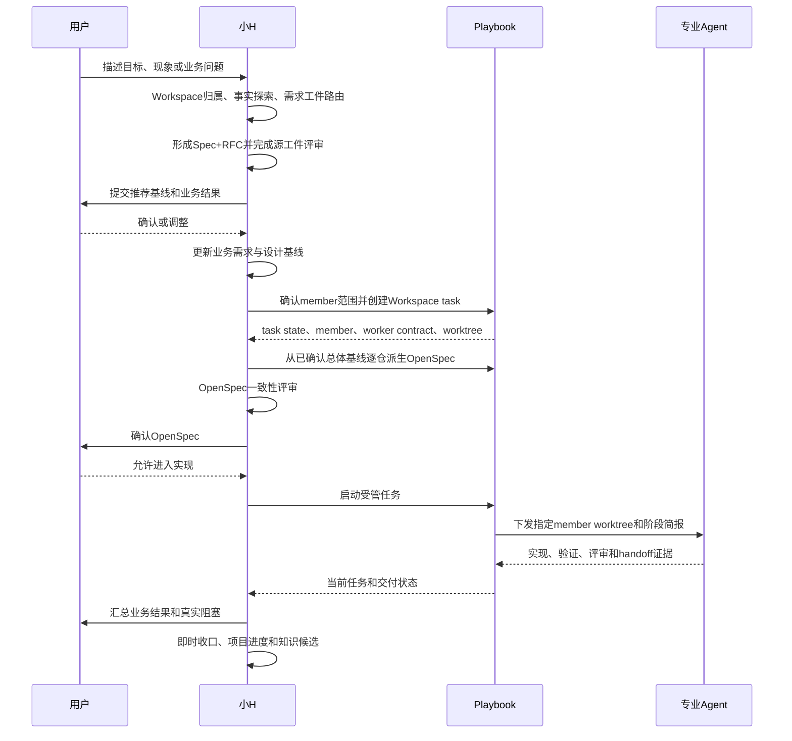

# 小H与Playbook的关系

> 适用版本：小H 2.11.0
>
> 文档定位：说明小H协调层与AI Dev Playbook执行治理平台如何分工、交接和共同约束专业Agent。
>
> 不包含：具体项目、客户、仓库、任务、账号或凭据。

## 1. 核心关系

小H与Playbook是上下协作关系，不是同一个组件，也不是互相替代：

- 小H是面向用户的根线程协调层，负责理解目标、核对事实、推荐方案、需求裁决、专业Agent路由、结果验收和长期知识写回。
- Playbook是面向研发执行的治理平台，负责Workspace、成员仓库、任务状态、OpenSpec、worktree、Git、门禁、验证、Issue/MR和交付闭环。

可以简化为：

```text
用户目标
  ↓
小H：理解、分析、推荐、需求基线和用户决策
  ↓
Playbook：把已确认范围变成受管Workspace任务和可检查执行状态
  ↓
专业Agent：在指定member worktree和worker contract内探索、实现或评审
  ↓
Playbook：验证、提交、远端协作、合并和任务闭环
  ↓
小H：验收业务结果、即时收口、刷新项目进度、沉淀长期知识
```

## 2. 职责对比

| 维度 | 小H | Playbook |
| --- | --- | --- |
| 面向对象 | 用户及当前根对话 | 项目Workspace、仓库和交付流程 |
| 核心目标 | 把用户意图转成正确、可确认、可持续推进的目标 | 把研发规则和交付状态变成可执行、可验证的门禁 |
| 需求职责 | 事实探索、需求工件路由、Spec+RFC、业务基线和用户确认 | 保存并执行仓库级OpenSpec、task和gate状态 |
| Agent职责 | 选择最小专业角色集合，综合不同角色结论 | 决定受管worker、member、worktree、依赖顺序和执行阶段 |
| 写入边界 | 全局能力、项目稳定知识和Obsidian收口 | 业务仓库、任务worktree、OpenSpec、Git和远端协作状态 |
| 状态事实源 | 当前用户决定、需求基线、验收结论 | Workspace metadata、task state、worker brief、Git/OpenSpec/gate状态 |
| 验证职责 | 判断结果是否满足业务目标，组织独立专业评审 | 执行或校验仓库级测试、pipeline、提交、MR和合并门禁 |
| 长期记忆 | 将验收后的稳定结论写入配置Vault | 将原始执行证据保存在任务、仓库和受管evidence中 |
| 外部动作 | 判断是否需要用户授权，不绕过人工边界 | 通过受管命令执行Issue、MR、review、merge、archive和cleanup |

## 3. 谁拥有哪种决定

| 决定或事实 | 责任主体 |
| --- | --- |
| 业务目标和结果取舍 | 用户 |
| 推荐方案、影响解释和待确认问题 | 小H |
| 业务规则是否已经确认 | 用户确认 + 小H基线记录 |
| 当前代码实际行为 | 代码、配置、数据和运行证据 |
| Workspace包含哪些member及其依赖 | `playbook-workspace.yaml`和Playbook Workspace状态 |
| 哪个member worktree允许写入 | Playbook task/worker返回 |
| 当前OpenSpec、Git flow和gate状态 | Playbook受管状态 |
| 某专业Agent是否适合参与 | 小H角色路由 |
| 专业Agent本轮能做什么 | 小H任务上下文与Playbook worker contract的权限交集 |
| 实现是否达到业务目标 | 小H综合用户验收、测试和评审证据 |
| 是否可以提交、推送、建MR或合并 | Playbook门禁 + 必要的人工授权 |
| 哪些结论进入长期知识 | 小H知识评审和晋升流程 |

小H不能用Obsidian或自己的任务摘要改写Playbook执行状态；Playbook也不能用“当前代码已经这样实现”替用户决定目标行为。

## 4. 从小H到Playbook的交接

复杂业务需求的标准交接点位于“用户确认总体Spec+RFC”之后：



在`spec_rfc_then_openspec`路线下，Spec+RFC确认前，小H只做只读探索和候选影响面分析，不最终确认member、不创建业务任务、不启动实现。

## 5. Agent同时遵守两套上下文

专业Agent进入Playbook任务后，同时受以下约束：

1. 小H公共契约和角色TOML：规定角色能力、Sandbox、证据格式和全局禁止事项。
2. 小H schema 1.4任务上下文：规定本轮目标、事实源、意图域、允许范围、验收和停止条件。
3. Workspace和仓库`AGENTS.md`：规定项目及仓库专属规则。
4. Playbook worker/task brief：规定实际member、worktree、allowed scope、依赖、当前阶段和输出契约。
5. 当前OpenSpec与Git/gate状态：规定要实现和验证的准确范围。

这些约束不是覆盖关系，而是取交集。任一层更严格时使用更严格边界；发生冲突时停止副作用，由小H重新对账，不能由专业Agent自行扩大权限。

Playbook已经返回worker/task简报时，它是执行状态的权威事实源。小H任务上下文只补充角色、长期知识路径、输出要求和停止条件，不能复制或覆盖受管状态。

## 6. 两套“收口”不是一回事

Playbook收口与小H收口解决不同问题：

| 收口 | 证明什么 | 主要产物 |
| --- | --- | --- |
| Playbook任务闭环 | 仓库任务是否完成了OpenSpec、实现、验证、提交、MR、合并和回收门禁 | task state、Git、MR、pipeline、audit和evidence |
| 小H即时收口 | 当前已验收结果为什么成立、对项目有什么影响、后续如何召回和复用 | 当日记录、项目进度、需求基线引用和知识候选 |

小H不能因为写完Obsidian记录就把Playbook任务标成完成；Playbook任务完成后，小H也不能等待每日定时任务才补项目总结。

## 7. 三种使用场景

### 7.1 业务项目开发

- 意图域：`business_project`。
- 小H先处理项目归属、需求和业务确认。
- Playbook负责受管Workspace和实际交付生命周期。
- 业务代码只在Playbook返回的task worktree中修改。

### 7.2 修改Playbook产品本身

- 意图域：`playbook_platform`。
- Playbook源码仓库及其自身OpenSpec是实施事实源。
- 不能借某个下游业务Workspace承载平台修复。
- 收口写入Vault的`07-工作记录/平台`，不伪造业务项目进度。

### 7.3 修改小H、Agent或Skill

- 意图域：`global_agent_capability`。
- 不创建业务Playbook task，也不修改业务仓库。
- 在小H源码仓库完成实现、验证和发布。
- 收口写入Vault的`07-工作记录/全局能力`。

## 8. 不能绕过Playbook的情况

对已由Playbook管理的业务项目，以下动作必须走受管入口：

- 创建和启动编程任务。
- 创建member task worktree。
- 确认当前active change和OpenSpec状态。
- 运行受管验证和交付gate。
- 提交代码。
- 创建或更新Issue/MR。
- AI review、人工Approve、merge、finalize、archive、cleanup和任务closeout。

小H可以决定“为什么做、目标是什么、采用什么已确认方案、需要哪些专业判断”，但不能用普通Git命令、Obsidian记录或自然语言承诺替代上述Playbook状态。

只读咨询、需求分析和全局小H能力修改不因为本机安装了Playbook就自动变成业务任务。是否进入Playbook生命周期由意图域、项目是否受管和当前动作共同决定。

## 9. 失败和冲突处理

| 场景 | 处理 |
| --- | --- |
| 小H需求基线与Playbook OpenSpec不一致 | 暂停后续实现，回到已确认业务语义修订工件 |
| 小H任务上下文与worker brief范围冲突 | 停止副作用，由小H重新生成上下文或修正任务范围 |
| Playbook状态与实际Git/worktree不一致 | 使用Playbook诊断和受管恢复，不靠自然语言假定状态 |
| OpenSpec已经存在但漏跑Spec+RFC | 进入`retroactive_normalization`，补齐并评审总体基线 |
| 业务代码位于base repo或错误worktree | 不修改，切换或创建正确task worktree |
| 远端凭据、Approve或生产动作缺失 | 保持人工边界，报告恢复条件 |
| Playbook任务完成但小H未收口 | 立即补小H收口并标记延迟事实，不修改Playbook历史 |
| 小H已写记录但Playbook未闭环 | Obsidian记录不能提升Playbook状态，继续受管流程 |

## 10. 一句话介绍

> 小H负责把人的目标变成正确、可确认的研发决策，并协调专业Agent；Playbook负责把这些决策放进受管Workspace，以OpenSpec、worktree、Git和交付门禁完成可验证执行；任务完成后，小H再把已验收结果沉淀为项目上下文和长期知识。

## 11. 相关文档

- [小H实现设计](implementation-design.md)
- [安全与可信边界](../SECURITY.md)
