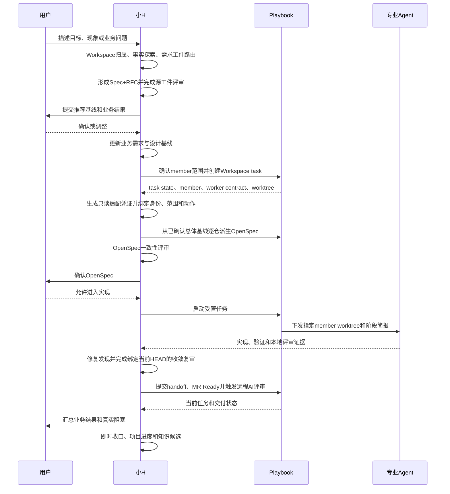

# 小H与Playbook的关系

> 适用版本：小H 2.17.0
>
> 本文说明小H和AI Dev Playbook各自负责什么，以及一项受管任务如何在两者之间交接。
>
> 不包含：具体项目、客户、仓库、任务、账号或凭据。

## 1. 先说结论

小H可以独立工作，Playbook不是它的运行前提。只有当前任务已经明确交给Playbook管理，两者才会进入受管协作。

小H面向用户，负责理解目标、核对事实、推荐方案、协调专业Agent、验收结果和维护长期知识。Playbook面向研发执行，管理Workspace、仓库、任务状态、OpenSpec、worktree、Git和交付门禁。

所有实现都先经过小H的本地多角色评审。Playbook受管任务在本地评审通过后，还要继续完成Playbook的远程评审和交付门禁。两层评审检查的状态不同，不能互相替代。

是否启用由`~/.xiaoh/config.json`中的`integrations.playbook`控制：

| 模式 | 独立使用小H | Playbook受管任务 |
| --- | --- | --- |
| `auto`（默认） | 不探测缺失CLI，不降级核心 | 任务明确受管后要求兼容并启用适配 |
| `enabled` | Doctor主动验证兼容性 | 缺失或不兼容时失败关闭 |
| `disabled` | 完全跳过Playbook探测 | 禁止受管委派，直到修改配置 |

安装了Playbook命令，不代表当前任务受管，也不会让普通任务自动套用Playbook门禁。

Playbook CLI的安装、升级、降级、重装、版本切换和安装源切换由用户人工完成。小H、专业Agent、Skill和Hook只读核对`playbook --version`、`playbook version check`、命令路径和包元数据。Playbook或错误恢复信息即使给出升级命令，小H也只报告建议，不代为执行。公共契约和Doctor负责检查这条边界，但不会安装命令级机械门禁，也不会干预用户在Codex外部终端中的人工维护。

一次受管任务的关系如下：

```text
用户目标
  ↓
小H：理解、分析、推荐、需求基线和用户决策
  ↓
Playbook：把已确认范围变成受管Workspace任务和可检查执行状态
  ↓
专业Agent：在指定member worktree和worker contract内探索、实现或评审
  ↓
Playbook：验证、提交、远端协作、合并和任务闭环
  ↓
小H：验收业务结果、即时收口、刷新项目进度、沉淀长期知识
```

## 2. 职责对比

| 维度 | 小H | Playbook |
| --- | --- | --- |
| 面向对象 | 用户及当前根对话 | 项目Workspace、仓库和交付流程 |
| 核心目标 | 把用户意图转成正确、可确认、可持续推进的目标 | 把研发规则和交付状态变成可执行、可验证的门禁 |
| 需求职责 | 事实探索、需求工件路由、Spec+RFC、业务基线和用户确认 | 保存并执行仓库级OpenSpec、task和gate状态 |
| Agent职责 | 选择最小专业角色集合，综合不同角色结论 | 决定受管worker、member、worktree、依赖顺序和执行阶段 |
| 写入边界 | 全局能力、项目稳定知识和Obsidian收口 | 业务仓库、任务worktree、OpenSpec、Git和远端协作状态 |
| 状态事实源 | 当前用户决定、需求基线、验收结论 | Workspace metadata、task state、worker brief、Git/OpenSpec/gate状态 |
| 验证职责 | 判断结果是否满足业务目标，组织独立专业评审 | 执行或校验仓库级测试、pipeline、提交、MR和合并门禁 |
| 长期记忆 | 将验收后的稳定结论写入配置Vault | 将原始执行证据保存在任务、仓库和受管evidence中 |
| 外部动作 | 判断是否需要用户授权，不绕过人工边界 | 通过受管命令执行Issue、MR、review、merge、archive和cleanup |

## 3. 决定和事实归谁

| 决定或事实 | 责任主体 |
| --- | --- |
| 业务目标和结果取舍 | 用户 |
| 推荐方案、影响解释和待确认问题 | 小H |
| 业务规则是否已经确认 | 用户确认 + 小H基线记录 |
| 当前代码实际行为 | 代码、配置、数据和运行证据 |
| Workspace包含哪些member及其依赖 | `playbook-workspace.yaml`和Playbook Workspace状态 |
| 哪个member worktree允许写入 | Playbook task/worker返回 |
| 当前OpenSpec、Git flow和gate状态 | Playbook受管状态 |
| 某专业Agent是否适合参与 | 小H角色路由 |
| 专业Agent本轮能做什么 | 小H任务上下文与Playbook worker contract的权限交集 |
| 实现是否达到业务目标 | 小H综合用户验收、测试和评审证据 |
| 是否可以提交、推送、建MR或合并 | Playbook门禁 + 必要的人工授权 |
| 哪些结论进入长期知识 | 小H知识评审和晋升流程 |

小H不能用Obsidian或任务摘要改写Playbook执行状态。Playbook也不能因为当前代码已经这样实现，就替用户决定目标行为。

## 4. 从小H到Playbook的交接

复杂业务需求在用户确认总体Spec+RFC后交给Playbook：



在`spec_rfc_then_openspec`路线下，Spec+RFC确认前，小H只做只读探索和候选影响面分析，不最终确认member、不创建业务任务、不启动实现。

## 5. Agent同时遵守两套上下文

专业Agent进入Playbook任务后，同时受以下约束：

1. 小H公共契约和角色TOML：规定角色能力、Sandbox、证据格式和全局禁止事项。
2. 小H schema 1.6稳定任务授权：规定项目历史召回、本轮目标、事实源、意图域、允许范围、角色动作、验收和停止条件。
3. 小H单次执行绑定：绑定本次唯一Agent名称、动作、评审轮次、对象摘要和Playbook短时收据，不复制Playbook状态。
4. Workspace和仓库`AGENTS.md`：规定项目及仓库专属规则。
5. Playbook worker/task brief：规定实际member、worktree、allowed scope、依赖、当前阶段和输出契约。
6. 当前OpenSpec与Git/gate状态：规定要实现和验证的准确范围。

这些约束不是覆盖关系，而是取交集。任一层更严格时使用更严格边界；发生冲突时停止副作用，由小H重新对账，不能由专业Agent自行扩大权限。

Playbook已经返回worker/task简报时，它是执行状态的权威事实源。小H任务上下文只补充角色、长期知识路径、输出要求和停止条件，不能复制或覆盖受管状态。

项目历史召回在Playbook交接前由小H独立完成。Playbook的worker/status可以补充当前任务事实，但不能替代配置Vault中的项目进度、已验收收口、规范需求基线和正式知识；没有Playbook时，这条召回门禁仍然照常工作。

小H的可选适配层不改变这项分工。它只在任务明确受管且集成模式允许时读取Playbook现有的worker JSON与完整task status JSON，生成默认15分钟有效的绑定凭证，并在正式委派前校验：

- 小H长期项目身份`xiaoh_workspace_id`与Playbook当前任务身份`task_workspace_id`分别存在。
- worker的member、worktree和allowed scope与只读状态快照一致。
- 原始JSON、凭证文件和当前任务上下文哈希未发生变化。
- 本轮专业Agent只执行凭证绑定的一个delegated action。
- worker重启、范围变化、任务接管或恢复后已经重新捕获。
- worker/status原始文件刚刚生成、顺序正确，任务仍为非终态（多member任务允许其他member造成任务级`blocked`），当前member worktree仍有效，且每一项delegated scope均未超出任务上下文授权。
- 在正式委派准备和SubagentStart消费时重新执行只读task status并核对当前身份、状态和worktree。

适配层不写Playbook、不推进task状态、不生成兼容默认值，也不维护第二套状态机。15分钟时效只约束授权与启动；任务收口按凭证与实际Agent启动时间审计当时是否有效，不要求历史凭证在收口时仍是“现在新鲜”。Playbook接口缺失或语义不兼容时，小H报告检测到的版本并停止受管业务委派，等待后续更新小H适配器。

## 6. 受管实现的两层评审

代码实现先通过小H本地闭环，再进入Playbook远程闭环：

1. 实现者完成自检、测试与适用工程Gate。
2. 小H调用`xiaoh-local-review`，至少选择两个未参与实现的判断角色。
3. 第一轮多角色评审发现问题后，小H安排修复并重跑受影响验证。
4. 收敛轮绑定当前Git HEAD；仍有阻断问题则继续循环。
5. 本地最终清单验证通过后，才允许`ready_for_integration=true`、MR Ready或远程AI评审。
6. Playbook远程`changes_requested`返回实现与本地复审；新HEAD不得复用旧结论。
7. Playbook远程`passed`仍不能替代当前HEAD pipeline和GitLab人工Approval。

`disabled`、`skipped`和`accepted_without_verdict`是有原因的例外处置，不是质量通过。小H只能在明确项目策略或用户知悉影响后的决策下接受例外，高风险PKI、安全或数据迁移任务不得自行降级。

未受管项目使用相同本地闭环，但不伪造Playbook task、worker、handoff或finalize状态。需要MR时按仓库规则执行远程评审和人工Approval；不需要远程交付时，本地清单、验证证据和小H即时收口构成完整闭环。

## 7. 两种收口记录不同的事实

Playbook收口记录仓库任务是否完成。小H收口记录结果为什么成立，以及后续如何召回。

| 收口 | 证明什么 | 主要产物 |
| --- | --- | --- |
| Playbook任务闭环 | 仓库任务是否完成了OpenSpec、实现、验证、提交、MR、合并和回收门禁 | task state、Git、MR、pipeline、audit和evidence |
| 小H即时收口 | 当前已验收结果为什么成立、对项目有什么影响、后续如何召回和复用 | 当日记录、项目进度、需求基线引用和知识候选 |

小H不能因为写完Obsidian记录就把Playbook任务标成完成；Playbook任务完成后，小H也不能等待每日定时任务才补项目总结。

## 8. 三种使用场景

### 8.1 业务项目开发

- 意图域：`business_project`。
- 小H先处理项目归属、需求和业务确认。
- Playbook负责受管Workspace和实际交付生命周期。
- 业务代码只在Playbook返回的task worktree中修改。

### 8.2 修改Playbook产品本身

- 意图域：`playbook_platform`。
- Playbook源码仓库及其自身OpenSpec是实施事实源。
- 不能借某个下游业务Workspace承载平台修复。
- 收口写入Vault的`07-工作记录/平台`，不伪造业务项目进度。

### 8.3 修改小H、Agent或Skill

- 意图域：`global_agent_capability`。
- 不创建业务Playbook task，也不修改业务仓库。
- 在小H源码仓库完成实现、验证和发布。
- 收口写入Vault的`07-工作记录/全局能力`。

## 9. 不能绕过Playbook的情况

对已由Playbook管理的业务项目，以下动作必须走受管入口：

- 创建和启动编程任务。
- 创建member task worktree。
- 确认当前active change和OpenSpec状态。
- 运行受管验证和交付gate。
- 提交代码。
- 创建或更新Issue/MR。
- AI review、人工Approve、merge、finalize、archive、cleanup和任务closeout。

小H可以决定“为什么做、目标是什么、采用什么已确认方案、需要哪些专业判断”，但不能用普通Git命令、Obsidian记录或自然语言承诺替代上述Playbook状态。

只读咨询、需求分析和全局小H能力修改不因为本机安装了Playbook就自动变成业务任务。是否进入Playbook生命周期由意图域、项目是否受管和当前动作共同决定。

## 10. 失败和冲突处理

| 场景 | 处理 |
| --- | --- |
| 小H需求基线与Playbook OpenSpec不一致 | 暂停后续实现，回到已确认业务语义修订工件 |
| 小H任务上下文与worker brief范围冲突 | 停止副作用，由小H重新生成上下文或修正任务范围 |
| 小H Playbook适配凭证缺失、过期或来源变化 | 重新读取当前worker/status JSON并生成新凭证；不修改Playbook |
| Playbook CLI接口不满足适配契约 | 小H保持全局能力可用，停止受管业务委派并等待适配更新 |
| Playbook状态与实际Git/worktree不一致 | 使用Playbook诊断和受管恢复，不靠自然语言假定状态 |
| OpenSpec已经存在但漏跑Spec+RFC | 进入`retroactive_normalization`，补齐并评审总体基线 |
| 业务代码位于base repo或错误worktree | 不修改，切换或创建正确task worktree |
| 远端凭据、Approve或生产动作缺失 | 保持人工边界，报告恢复条件 |
| Playbook任务完成但小H未收口 | 立即补小H收口并标记延迟事实，不修改Playbook历史 |
| 小H已写记录但Playbook未闭环 | Obsidian记录不能提升Playbook状态，继续受管流程 |

## 11. 对外怎么介绍

> 小H负责把人的目标变成正确、可确认的研发决策，并协调专业Agent；Playbook负责把这些决策放进受管Workspace，以OpenSpec、worktree、Git和交付门禁完成可验证执行；任务完成后，小H再把已验收结果沉淀为项目上下文和长期知识。

## 12. 相关文档

- [认识小H](xiaoh-guide.md)
- [小H实现设计](implementation-design.md)
- [安全与可信边界](../SECURITY.md)
